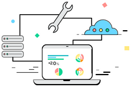
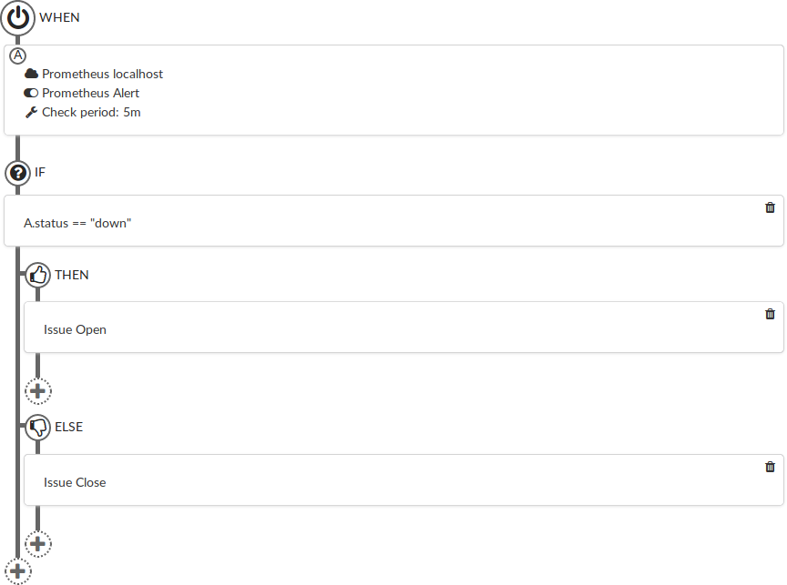

# Serverboards
https://serverboards.io

## IT Infrastructure Dashboards and management tools

Serverboards makes it easy for you to control your IT Infrastructure from a
single dashboard. Servers, virtual machines, websites, databases and more can
be monitored or managed in an easy way.

<p align="center">
  
</p>

## Automated work flows made easy with our GUI-based rules composer

Easily monitor your server performance in real time, manage your virtual
machines and automate most common infrastructure issues.

<p align="center">
  
</p>

## Embedded SSH terminal by default

Serverboards comes with an embedded SSH terminal. Easily perform console actions
from the very same place to troubleshoot faster.

<p align="center">
  
</p>

## Built in Issues and Logs with alerting

If something happens, you can access the traces in our in-built logging solution
and identify what caused the error.

<p align="center">
  
</p>

## Plugin based

Serverboards is based on simple to develop plugins that do all the small tasks
like checking if a service is UP, gathering the information and showing
information to the user, letting Serverboards Core do all the orchestration and
heavy work.

## Collaborate / Develop with Serverboards

Serverboards is licensed under the Apache 2 license, and plugins can be
developed by third parties using any license. Please refer to
https://serverboards.io/developers/ for more information.

* Issue tracker at [github](https://github.com/serverboards/serverboards/issues)
* Forums for troubleshooting and hanging around at
  https://forum.serverboards.io/
* Subscribe to our newsletter at https://serverboards.io

## Install and Download instructions

Serverboards can be downloaded to be used on Ubuntu 16.04 (and maybe others) at
https://serverboards.io/downloads/

## Compiling and running the server

If you plan to develop Serverboards core itself, first compile it once to ensure
you have all the required dependencies:

```shell
make
```

And then you may run it executing these commands in two different terminals:

Terminal 1:
```shell
cd backend
iex -S mix
```

Terminal 2:
```shell
cd frontend
npm start
```

Now you can connect to the backend at http://localhost:8080 or at the running
webpack server at http://localhost:3000 .

If you connect to the webpack server it is necessary to force the backend URL so
that the WebSocket can connect. Open the developer console at the browser (F12
or Crtl+Shift+C), and write:

```js
localStorage.servername="http://localhost:8080"
```

Alternatively you can create the release with `make release` and run it as
`rel/serverboards/bin/serverboards foreground`.

## Plugin development workflow

To develop new plugins create a directory or link to your source at
$SERVERBOARDS_PATH/plugins, which by default is on installed systems at
`/opt/serverboards/share/serverboards/plugins/`. If you use the development
version, it would be at `~/.local/serverboards/plugins/`.

Plugin manifest is normally reloaded automatically upon changes, and commands at
command restart. If it is necessary to force a command execution, you can
restart full Serverboards (`sudo service serverboards restart` or restart
backend process).
