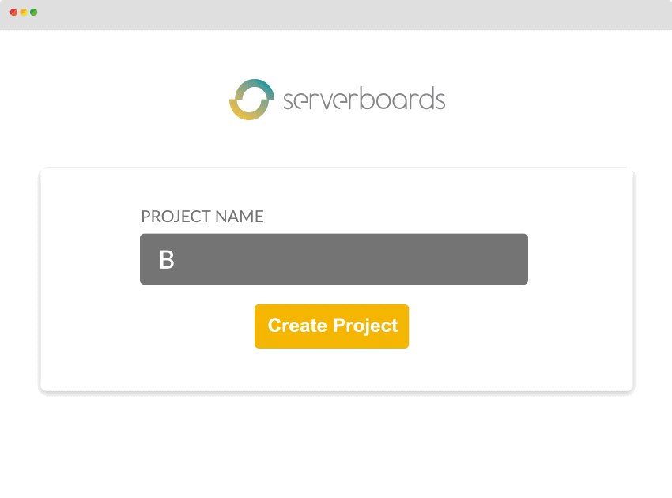

# Serverboards
https://serverboards.io



Serverboards is a service monitoring, management and automation platform.

It allows users to connect the myriad of disperse services nowadays we need to
be productive at our jobs. All the services we use are independant islands,
with their own protocols and APIs and a lot of integration work is needed to
make them talk each other.

With Serverboards it is very easy to create the small puzzle pieces required
to talk to the services, and to allow them to fit together.

Serverboards is based on a simple core that is in charge of communication
of all the microservices, doing all the common tasks that are needed:

* User management
* Project management
* Permissions
* Plugin management
* Notifications
* Issues

## Collaborate / Develop with Serverboards

Please use the issue tracker at
[github](https://github.com/serverboards/serverboards/issues) to report bugs and
feature requests.

It is developed under the Apache 2 license, and plugins can be developed by
third parties using any license. Please refer to
https://serverboards.io/developers/ for more information.

There are forums in place at https://disqus.com/home/channel/serverboards/

Subscribe to our newsletter at https://serverboards.io

## Download

Serverboards can be downloaded to be used on Ubuntu 16.04 (and maybe others) at
https://serverboards.io/downloads/

Access it at http://localhost:8080, and enter with your user and password. If
your user is in the `adm` or `admin` group it will have admin access, and can
add other users and disable PAM access.

## Compiling and running the server

If you plan to develop Serverboards core itself, first compile it once to ensure
you have all the required dependencies:

```shell
make
```

And then you may run it executing these commands in two different terminals:

Terminal 1:
```shell
cd backend
iex -S mix
```

Terminal 2:
```shell
cd frontend
npm start
```

Now you can connect to the backend at http://localhost:8080 or at the running
webpack server at http://localhost:3000 .

If you connect to the webpack server it is necessary to force the backend URL so
that the Websocket can connect. Open the developer console at the browser (F12
or Crtl+Shift+C), and write:

```js
localStorage.servername="http://localhost:8080"
```

Alternatively you can create the release with `make release` and run it as
`rel/serverboards/bin/serverboards foreground`.

## Plugin development workflow

To devlop new plugins create a directory or link to your source at
$SERVERBOARDS_PATH/plugins, which by default is on installed systems at
`/opt/serverboards/share/serverboards/plugins/`. If you use the development
version, it would be at `~/.local/serverboards/plugins/`.

Plugin manifest is normally reloaded automatically upon changes, and commands at
command restart. If it is necessary to force a command execution, you can
restart full Serverboards (`sudo service serverboards restart` or restart
backend process).
